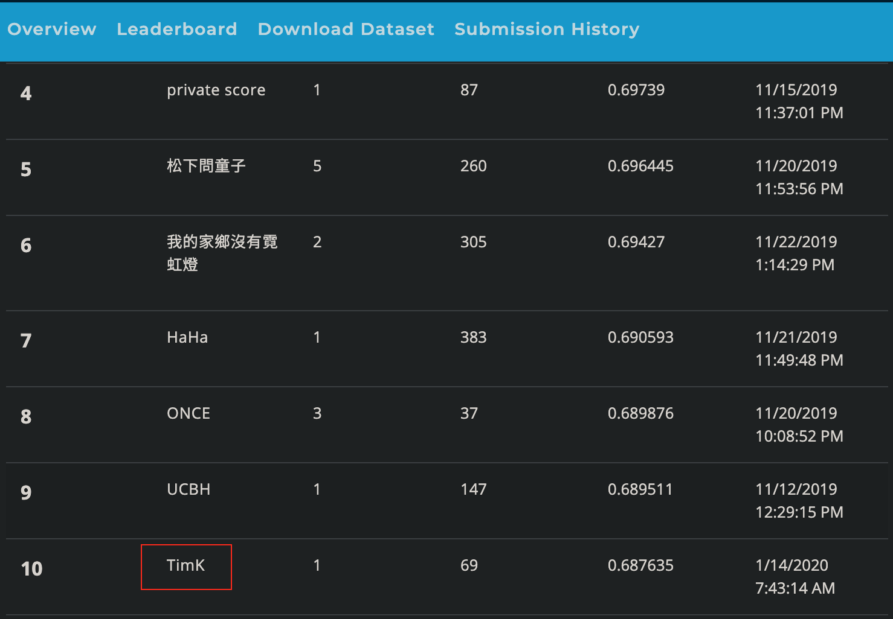
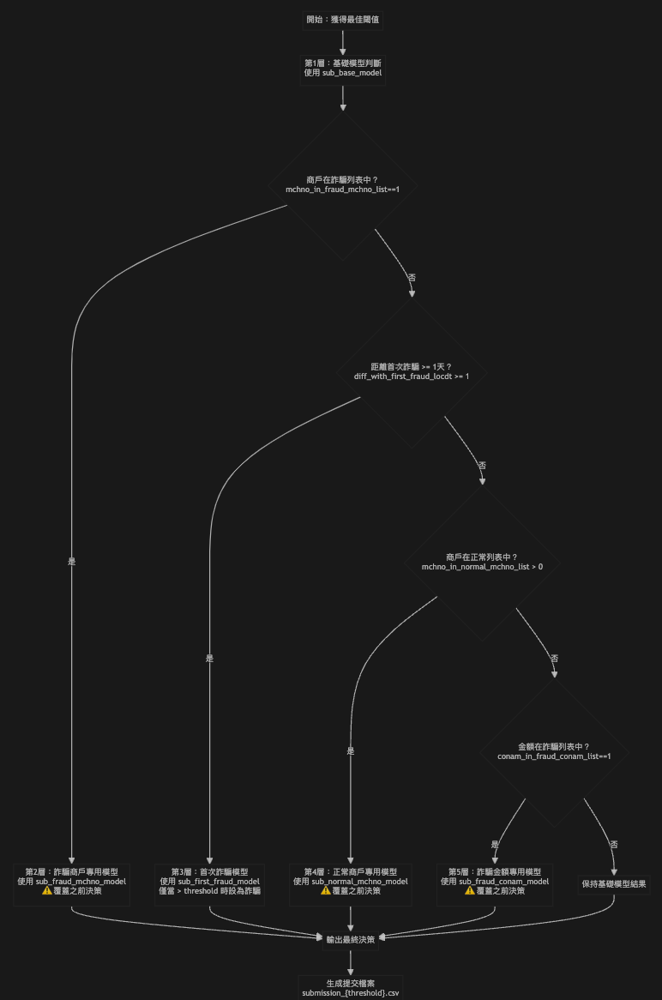

# 🏆 玉山人工智慧公開挑戰賽2019秋季賽 - 信用卡盜刷偵測

## 📋 問題介紹

### 競賽背景
本專案參與玉山人工智慧公開挑戰賽2019秋季賽「真相只有一個『信用卡盜刷偵測』」，旨在建立高效能的信用卡反盜刷偵測模型。
https://tbrain.trendmicro.com.tw/Competitions/Details/10

### 問題定義
- **任務類型**：二分類問題
- **目標**：判斷信用卡交易是否為盜刷交易
- **挑戰**：處理高度不平衡的數據集，在保持高召回率的同時控制誤報率
- **評估指標**：F1-Score 和 Average Precision

### 業務價值
- **風險控制**：及時識別盜刷交易，降低金融損失
- **用戶體驗**：減少正常交易的誤攔截，提升用戶滿意度
- **合規要求**：滿足金融監管對反詐騙系統的要求

## 🏅 參賽名次

<div align="center">

</div>

**最終排名：第10名** 🎉
- **團隊名稱**：TimK
- **最終得分**：0.687635
- **提交次數**：69次
- **競賽時間**：2019年11月-2020年1月

## 🚀 Repository 使用說明

### 環境需求
```bash
# Python 版本
Python 3.8+

# 主要套件
pandas >= 1.3.0
numpy >= 1.21.0
scikit-learn >= 1.0.0
lightgbm >= 3.2.0
matplotlib >= 3.5.0
seaborn >= 0.11.0
joblib >= 1.1.0
```

### 快速開始
```bash
# 1. 克隆專案
git clone https://github.com/your-username/Credit-card-fraud-detection.git
cd Credit-card-fraud-detection

# 2. 安裝依賴
pip install -r requirements.txt

# 3. 執行主要流程
jupyter notebook 1_main_lgbm.ipynb
```

### 檔案結構
```
Credit-card-fraud-detection/
├── data/                          # 數據目錄
├── preprocess/                    # 預處理模組
│   ├── preprocess_init.py         # 基礎預處理
│   ├── preprocess_time.py         # 時間特徵工程
│   ├── preprocess_conam.py        # 金額特徵工程
│   ├── preprocess_mchno.py        # 商戶特徵工程
│   └── ...
├── model/                         # 模型相關
│   ├── lgbm_model.py             # LightGBM 模型封裝
│   └── ...
├── util/                          # 工具函數
│   ├── generate_X_y.py           # 數據準備
│   ├── threshold_optimization.py  # 閾值優化
│   └── ...
├── 1_main_lgbm.ipynb            # 主要執行流程
└── README.md                     # 專案說明
```

## 📊 原始資料說明

### 數據概覽
- **訓練集**：1,521,787 筆交易記錄（授權日期 1-90 天）
- **測試集**：421,665 筆交易記錄（授權日期 91-120 天）
- **時間跨度**：120 天的信用卡授權交易紀錄
- **標籤分布**：高度不平衡（詐騙交易 < 1%）

### 欄位詳細說明

| 欄位名稱 | 中文說明 | 數據類型 | 業務意義 |
|----------|----------|----------|----------|
| `bacno` | 歸戶帳號 | 類別型 | 用戶唯一識別碼，用於 GroupKFold |
| `txkey` | 交易序號 | 數值型 | 交易唯一識別碼 |
| `locdt` | 授權日期 | 數值型 | 交易發生日期（1-120） |
| `loctm` | 授權時間 | 數值型 | 交易發生時間 |
| `cano` | 交易卡號 | 類別型 | 信用卡號碼（已脫敏） |
| `contp` | 交易類別 | 類別型 | 交易類型分類 |
| `etymd` | 交易型態 | 類別型 | 交易模式識別 |
| `mchno` | 特店代號 | 類別型 | 商戶識別碼 |
| `acqic` | 收單行代碼 | 類別型 | 收單銀行識別 |
| `mcc` | MCC_CODE | 類別型 | 商戶類別代碼 |
| `conam` | 交易金額 | 數值型 | 台幣金額（已轉換） |
| `ecfg` | 網路交易註記 | 類別型 | 線上/線下交易標識 |
| `insfg` | 分期交易註記 | 類別型 | 分期付款標識 |
| `iterm` | 分期期數 | 數值型 | 分期付款期數 |
| `stocn` | 消費地國別 | 類別型 | 交易發生國家 |
| `scity` | 消費城市 | 類別型 | 交易發生城市 |
| `stscd` | 狀態碼 | 類別型 | 交易狀態 |
| `ovrlt` | 超額註記碼 | 類別型 | 超額使用標識 |
| `flbmk` | Fallback 註記 | 類別型 | 降級交易標識 |
| `hcefg` | 支付形態 | 類別型 | 支付方式 |
| `csmcu` | 消費地幣別 | 類別型 | 交易幣種 |
| `flg_3dsmk` | 3DS 交易註記 | 類別型 | 3D安全驗證標識 |
| `fraud_ind` | 盜刷註記 | 目標變數 | 0: 正常, 1: 盜刷 |

## 🔧 特徵工程說明

### 特徵工程架構
我們的特徵工程分為六大類別，總計創建超過100個衍生特徵：

#### 1. 時間特徵 (`preprocess_time.py`)
- **全域時間轉換**：將 `locdt` 和 `loctm` 轉換為連續時間戳
- **時間差特徵**：計算與上一筆交易的時間間隔
- **時間統計特徵**：每日交易頻率、時段分布等

#### 2. 交易頻率特徵 (`preprocess_transaction_frequency.py`)
- **卡號交易頻率**：`cano_locdt_txkey_count`
- **帳戶交易頻率**：`bacno_locdt_mchno_txkey_count`
- **累積交易統計**：滑動窗口內的交易次數

#### 3. 金額特徵 (`preprocess_conam.py`)
- **金額統計**：最大值、最小值、標準差、平均值
- **零金額分析**：零金額交易的時間差異
- **異常金額檢測**：基於歷史數據的異常金額識別

#### 4. 商戶特徵 (`preprocess_mchno.py`)
- **商戶交易模式**：首次/最後交易時間差
- **商戶風險評估**：基於歷史詐騙記錄的商戶評分
- **商戶交易序列**：在特定商戶的交易順序

#### 5. 換卡行為特徵 (`preprocess_change_card.py`)
- **換卡檢測**：識別同一帳戶的換卡行為
- **換卡時間分析**：換卡前後的時間差異
- **換卡風險評估**：換卡後的異常交易檢測

#### 6. 特殊模式特徵 (`preprocess_special_features.py`)
- **詐騙模式識別**：基於已知詐騙案例的模式匹配
- **異常行為檢測**：偏離正常行為的交易模式
- **風險累積評分**：多維度風險因子的綜合評分

### 特徵選擇策略
- **統計顯著性**：使用卡方檢驗和互信息篩選特徵
- **業務邏輯**：結合領域知識保留有意義的特徵
- **模型重要性**：基於 LightGBM 特徵重要性進行篩選
- **相關性分析**：移除高度相關的冗餘特徵

## 🎯 訓練方法與數據切分

### GroupKFold 交叉驗證
```python
# 使用 bacno_transfer 作為分組依據
folds = GroupKFold(n_splits=10)
for train_idx, valid_idx in folds.split(X, y, groups):
    # 確保同一用戶的所有交易在同一個 fold 中
    # 避免數據洩漏，提供更真實的性能評估
```

### 數據切分策略
- **時間切分**：訓練集（1-90天）→ 測試集（91-120天）
- **用戶分組**：使用 `bacno_transfer` 確保同一用戶不跨 fold
- **類別平衡**：在每個 fold 中保持詐騙比例一致

### 訓練集處理
```python
# 1. 類別特徵對齊
# 將訓練集中不在測試集的類別值設為 NaN
# 保護關鍵業務標識符（bacno, cano, mchno）

# 2. 特徵標準化
# 數值特徵進行標準化處理
# 類別特徵使用 LightGBM 自動處理

# 3. 異常值處理
# 基於業務邏輯識別和處理異常值
```

## 🤖 LightGBM 模型架構

### 模型配置
```python
LGBMClassifier(
    boosting_type='gbdt',        # 梯度提升決策樹
    n_estimators=1000,           # 樹的數量
    learning_rate=0.1,           # 學習率
    num_leaves=16,               # 葉子數量（控制複雜度）
    max_depth=-1,                # 不限制深度
    reg_alpha=10,                # L1 正則化
    reg_lambda=7,                # L2 正則化
    min_child_samples=200,       # 葉子節點最小樣本數
    random_state=10,             # 隨機種子
    n_jobs=-1                    # 並行處理
)
```

### 訓練策略
- **Early Stopping**：防止過擬合，提高泛化能力
- **自定義評估指標**：使用 Average Precision 和 F1-Score
- **特徵重要性追蹤**：記錄每個 fold 的特徵重要性

### 模型優化
- **超參數調優**：針對不平衡數據集優化參數
- **正則化**：使用 L1/L2 正則化防止過擬合
- **類別權重**：處理不平衡數據集的策略

## 🎨 多層級決策系統

### 決策流程圖
<div align="center">

</div>

### 模型組合策略

我們的最終預測系統採用**多層級決策架構**，根據不同的風險特徵使用專門的模型：

#### 🔍 第1層：基礎模型判斷
- **模型**：`sub_base_model`
- **功能**：對所有交易進行初步風險評估
- **特點**：使用全量特徵的通用模型

#### ⚠️ 第2層：詐騙商戶檢測
- **模型**：`sub_fraud_mchno_model`
- **觸發條件**：`mchno_in_fraud_mchno_list == 1`
- **功能**：針對已知風險商戶的專用檢測
- **策略**：完全覆蓋基礎模型判斷

#### 🕐 第3層：時間風險評估
- **模型**：`sub_first_fraud_model`
- **觸發條件**：`diff_with_first_fraud_locdt >= 1`
- **功能**：評估首次詐騙事件後的時間風險
- **策略**：保守覆蓋（僅高分覆蓋）

#### ✅ 第4層：正常商戶異常檢測
- **模型**：`sub_normal_mchno_model`
- **觸發條件**：`mchno_in_normal_mchno_list > 0`
- **功能**：檢測正常商戶的異常交易行為
- **策略**：平衡檢測率和誤報率

#### 💰 第5層：金額模式識別
- **模型**：`sub_fraud_conam_model`
- **觸發條件**：`conam_in_fraud_conam_list == 1`
- **功能**：識別特定詐騙金額模式
- **策略**：精確打擊特定金額風險

### 閾值優化
```python
# 自動化閾值優化
result = find_optimal_threshold(
    y_true=y_train, 
    y_pred_proba=oof_predictions,
    metric='f1',
    threshold_range=(0.01, 0.99),
    step=0.01
)
optimal_threshold = result['best_threshold']
```

### 預測融合
```python
# Out-of-fold 預測統計
df_statistics = generate_statistic(df_sub_preds_LGBM)
# 移除異常值後的平均預測
final_predictions = df_statistics.apply(remove_outlier, axis=1)
```

## 📈 模型性能

### 評估指標
- **F1-Score**：平衡精確率和召回率
- **Average Precision**：PR曲線下面積，適合不平衡數據
- **ROC-AUC**：整體分類性能評估

### 交叉驗證結果
- **10-Fold GroupKFold**：確保用戶級別的數據隔離
- **穩定性評估**：多次運行的結果一致性
- **特徵重要性分析**：識別關鍵預測特徵

## 🔄 執行流程

### 完整執行步驟
1. **數據預處理**：執行 `1_main_lgbm.ipynb` 中的預處理部分
2. **特徵工程**：自動執行六大類特徵工程
3. **模型訓練**：10-Fold 交叉驗證訓練多個專用模型
4. **閾值優化**：自動搜索最佳決策閾值
5. **多層級決策**：應用5層決策系統生成最終預測
6. **結果輸出**：生成提交檔案 `submission_{threshold}.csv`

### 關鍵檔案說明
- **`1_main_lgbm.ipynb`**：主要執行流程，包含完整的建模pipeline
- **`preprocess/`**：模組化的特徵工程函數
- **`model/lgbm_model.py`**：LightGBM 模型封裝類
- **`util/threshold_optimization.py`**：閾值優化工具

## 🙏 致謝

感謝玉山人工智慧公開挑戰賽提供的平台和數據集，以及第三名團隊「阿罵我要吃糖果」的開源代碼參考，為本專案的開發提供了寶貴的啟發。

## 📄 授權

本專案採用 MIT 授權條款 - 詳見 [LICENSE](LICENSE) 檔案
